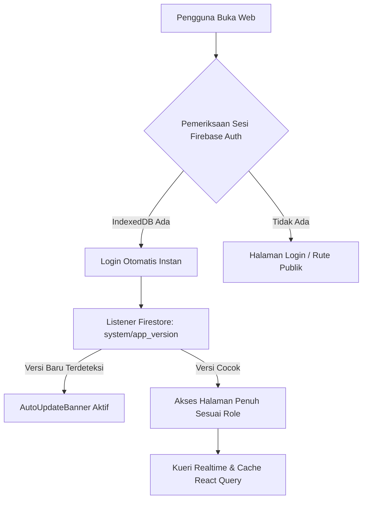

# Arsitektur Sistem & Desain Perangkat Lunak Tanabrew

Dokumen ini mendokumentasikan cetak biru (*system blueprint*), prinsip desain antarmuka, alur data (*data flow*), serta teknologi yang digunakan pada aplikasi **Tanabrew Stock & Invoice**.

---

## 🏛️ 1. Gambaran Umum & Filosofi Desain

Aplikasi Tanabrew dirancang dengan paradigma **Dual-Responsive Hybrid Architecture**:
1. **Smartphone & Tablet (< 1024px)**:
   - Beroperasi seperti Progressive Web App (PWA) modern.
   - *Floating Glassmorphic Bottom Navigation Bar* melayang dengan indikator titik aktif dan efek blur kaca.
   - Gestur tarik-layar muat ulang (*Pull-to-Refresh*).
   - Drawer modal sentuh dari bawah (*Bottom Sheet Dialog*).
2. **Desktop & Laptop (≥ 1024px — Opsi 01 Enhanced)**:
   - Beroperasi sebagai SaaS Web POS & Enterprise ERP Dashboard.
   - *Permanent Collapsible Left Sidebar* yang dapat diciutkan (`w-20`) atau dilebarkan (`w-64`) lengkap dengan jam digital live.
   - Multi-Kolom 12-Grid di Beranda (8 kolom analitik/stok + 4 kolom profil & kontrol).
   - Katalog Kartu Visual POS (*Square Style Touch Tiles*) di kasir untuk transaksi 1-tap.
   - Master-Detail Split Pane di Riwayat Transaksi (5 kolom daftar + 7 kolom sticky preview faktur resmi).

---

## 💻 2. Tumpukan Teknologi (Technology Stack)

* **Frontend Framework**: React 18, TypeScript, Vite.
* **Routing**: React Router v6 (dengan proteksi rute berbasis role).
* **Styling & Design System**: Tailwind CSS v3, Shadcn UI primitives, Lucide Icons, Fisika Pegas Spring Bezier (`cubic-bezier(0.16, 1, 0.3, 1)`).
* **State Management & Caching**:
  - TanStack React Query (untuk caching data produk dan inventaris).
  - React Context API (`AuthContext.tsx`) untuk manajemen sesi pengguna global.
* **Database & Cloud**: Google Firebase (Cloud Firestore Database, Firebase Authentication).
* **Serverless Backend (Edge Functions)**:
  - Vercel Serverless Functions (`/api/visitor-event.ts`, `/api/send-notification.ts`, `/api/pricelist.ts`).
* **Push Notifications**: OneSignal Web Push SDK + REST API.
* **Pembuatan Dokumen**: `jspdf` + `html2canvas` (100% diproses di browser klien tanpa API server).

---

## 🔄 3. Alur Data & Siklus Hidup Sesi (Session Lifecycle)

### Karakteristik Penting:
1. **Ketahanan Sesi (IndexedDB Persistence)**:
   - Token login Firebase disimpan di storage `IndexedDB` browser pengguna.
   - Pembaruan aplikasi (*auto-update* / reload halaman) **tidak akan pernah me-logout pengguna**.
2. **Sistem Deteksi Pembaruan Real-Time (Zero-Relog)**:
   - `AutoUpdateBanner.tsx` memantau dokumen `system/app_version` di Firestore.
   - Begitu versi di-deploy ke Vercel/GitHub, seluruh perangkat pengguna yang sedang aktif akan memunculkan banner rilis baru secara otomatis.
   - Jika kasir sedang mengisi keranjang POS kasir, sistem auto-reload cerdas akan menunda reload sampai transaksi selesai dicetak demi menjaga data kasir.

---

## 🛡️ 4. Perlindungan Stabilitas Global (Anti-Blank Screen)

1. **Global Error Boundary (`src/components/ErrorBoundary.tsx`)**:
   - Seluruh hierarki komponen di `src/App.tsx` dibungkus oleh `<ErrorBoundary>`.
   - Jika terjadi kendala parsing data atau koneksi jaringan sesaat, aplikasi menampilkan antarmuka ramah *"Terjadi Kendala Sementara"* dengan tombol muat ulang cepat tanpa membuat layar menjadi putih kosong (*white screen*).
2. **Safe Optional Chaining**:
   - Semua akses objek wajib menggunakan chaining aman: `userProfile?.role`, `invoice.items?.map(...)`, dengan fallback default (`|| []`, `|| 0`, `|| ""`).
3. **Penyelarasan Waktu Terpusat (`src/lib/dateUtils.ts`)**:
   - Seluruh parsing tanggal transaksi, pembuatan nomor invoice (`INV/TNB/YYYY/MM/XXXX`), dan grafik omzet wajib mengacu pada fungsi pembantu di `dateUtils.ts`.
