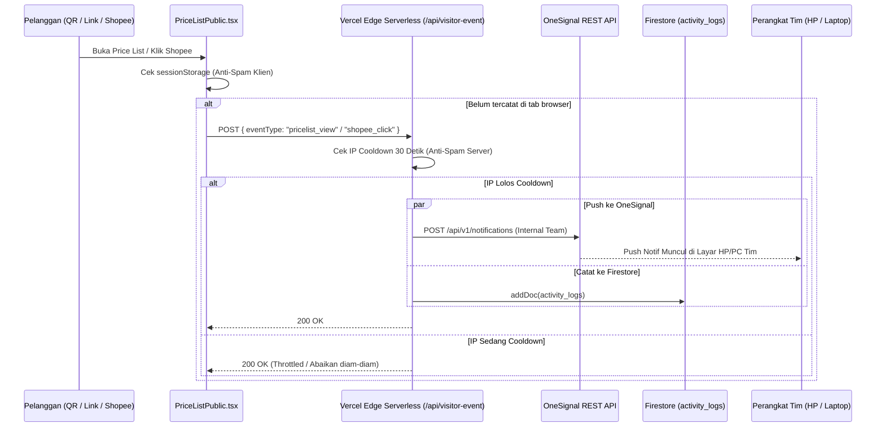

# Sistem Notifikasi & Pelacakan Pengunjung (Notification System)

Dokumen ini mendokumentasikan arsitektur push notification, alur pelacakan pengunjung (*visitor event tracking*), mekanisme anti-spam, dan integrasi OneSignal pada **Tanabrew Stock & Invoice**.

---

## 🔔 1. Arsitektur Komponen

---

## 🛡️ 2. Mekanisme Proteksi Anti-Spam Ganda (Dual-Layer Throttling)

Untuk mencegah notifikasi membombardir HP tim jika ada pengunjung yang me-refresh halaman terus-menerus atau membuka banyak tab:

1. **Proteksi Sisi Klien (`sessionStorage`)**:
   - Disimpan di memori tab peramban pengguna:
     - `tanabrew_tracked_pricelist_view`
     - `tanabrew_tracked_shopee_click`
   - Sekali terpicu, browser pengunjung tidak akan mengirim permintaan API lagi selama sesi tab tersebut aktif.
2. **Proteksi Sisi Server (`api/visitor-event.ts`)**:
   - Serverless function menyimpan jejak IP klien terakhir dalam map memori (*in-memory cache*).
   - Diberlakukan jeda waktu cooldown minimal **30 detik** per alamat IP untuk tipe event yang sama.
   - Jika ada IP yang sama memanggil endpoint sebelum 30 detik berakhir, server akan merespons `200 OK` tanpa memicu panggilan ke OneSignal maupun penulisan ke database.

---

## 📝 3. Standar Format & Teks Notifikasi (Bebas Emotikon)

Sesuai permintaan operasional, notifikasi otomatis pengunjung **wajib menggunakan bahasa formal, bersih, dan TANPA EMOTIKON**:

| Event | Header Notifikasi | Isi Pesan Notifikasi |
| :--- | :--- | :--- |
| **Buka Price List / Scan QR** | `Tanabrew Price List` | `"seseorang mengunjungi pricelist"` |
| **Klik Tombol Shopee** | `Tanabrew Shopee` | `"seseorang mengunjungi shopee tanabrew"` |

### Karakteristik OneSignal:
- Menggunakan OneSignal Segments: `["Total Subscriptions"]` untuk menyiarkan pesan ke seluruh perangkat anggota tim yang telah mengizinkan notifikasi browser (*web push*).
- Prioritas pengiriman: Level `10` (Immediate Delivery) agar sampai ke ponsel tim dalam hitungan detik.

---

## 🔒 4. Isolasi Halaman Publik

- Rute `/pricelist` dan `/menu` adalah halaman untuk pelanggan umum.
- Komponen `AutoUpdateBanner.tsx` dan modal `AppUpdateAnnouncementModal.tsx` **dilarang muncul** di rute ini.
- Pelanggan yang membaca menu tidak akan pernah terganggu oleh pesan update sistem atau jendela dialog internal.

---

## 🤖 5. Master Cron Dispatcher & Pemetaan Role Notifikasi (`api/cron-dispatcher.ts`)

Sistem dilengkapi tugas otomatis terjadwal yang berjalan setiap malam jam 23:00 WIB (16:00 UTC) melalui Vercel Cron Jobs:

1. **Owner & Webdev (Eksekutif)**:
   - **Kanal**: Email HTML Resmi (Resend) + Push Notification (OneSignal).
   - **Isi**: Laporan Tutup Buku Bulanan H-1 akhir bulan, Rekap Omzet Harian jam 23:00 WIB, Peringatan Slow-Moving Beans (tgl 15), dan Audit Kesehatan Database.
2. **Admin (Manajemen Stok & Tagihan)**:
   - **Kanal**: Email Ringkasan Operasional + Push Notification HP.
   - **Isi**: Pengingat Invoice Tempo Jatuh Tempo (Senin), Peringatan Stok Menipis Jogja & Lombok, Instruksi Stock Opname (tgl 28).
3. **Staff / Kasir (Operasional)**:
   - **Kanal**: Push Notification HP Saja.
   - **Isi**: Notifikasi Pengunjung Price List & Shopee, Peringatan Stok Kritis rak kasir, Pengingat Stock Opname fisik. Kasir terisolasi dari email omzet keuangan bisnis demi privasi finansial.

---

## 📧 6. Audit Deliverability Email: Mencegah Spam & Mengirim ke Seluruh Pengguna

### Mengapa Email Masuk ke Spam pada Resend Default?
1. **Domain Bersama (`onboarding@resend.dev`)**:
   Domain `resend.dev` adalah lingkungan pengujian (*sandbox*) publik Resend. Karena dipakai bersama secara massal oleh ribuan developer tanpa reputasi domain eksklusif, algoritma proteksi Google Gmail secara otomatis menandainya sebagai pesan otomatis uji coba dan memasukkannya ke tab **Spam / Promosi**.
2. **Batasan Pengiriman Resend Sandbox**:
   Pada mode uji coba tanpa domain sendiri, Resend memberlakukan aturan ketat: **hanya boleh mengirim ke alamat email pemilik akun Resend itu sendiri** (`danialgobel26@gmail.com`). Jika sistem mengirim ke email staff/admin lain, Resend akan menolaknya.
3. **Mengapa Domain `*.vercel.app` Tidak Bisa Didaftarkan di Resend?**:
   Resend memerlukan verifikasi DNS berupa *DNS Records* (SPF, DKIM, DMARC, MX). Subdomain Vercel (`https://tanabrew-stok-and-invoice.vercel.app`) adalah milik publik Vercel dan bukan domain milik pribadi, sehingga pengguna tidak memiliki hak untuk menambahkan DNS record ke server Vercel.

### 💡 Solusi & Rekomendasi Pengiriman Email:

#### Opsi A: Menggunakan Gmail SMTP Resmi (Nodemailer via Google App Password) — [REKOMENDASI TERBAIK: 100% GRATIS & BEBAS SPAM]
Sistem Tanabrew kini mendukung pengiriman langsung via **Gmail SMTP resmi Google**:
- **Bebas Spam**: Email dikirim langsung melalui server `smtp.gmail.com` milik Google dengan reputasi SPF & DKIM Google asli, sehingga **100% masuk ke Inbox Utama**, bukan Spam.
- **Kirim ke Semua User**: Tidak ada batasan domain; dapat mengirim ke seluruh email owner, admin, staff, maupun pelanggan.
- **100% Gratis & Tanpa Beli Domain**:
  1. Buka [Google Account Security](https://myaccount.google.com/apppasswords).
  2. Pastikan Verifikasi 2 Langkah (*2-Step Verification*) aktif di akun Google Anda (`danialgobel26@gmail.com`).
  3. Buat **Sandi Aplikasi (App Password)** dengan nama "Tanabrew Cron".
  4. Salin 16 digit kode sandi tersebut.
  5. Tambahkan di Vercel Dashboard > Settings > Environment Variables:
     - `GMAIL_USER`: `danialgobel26@gmail.com`
     - `GMAIL_APP_PASSWORD`: `16-digit-sandi-aplikasi-google`

#### Opsi B: Menggunakan Custom Domain Pribadi di Resend
Jika di kemudian hari Tanabrew membeli domain bisnis sendiri (misal `tanabrew.com` atau `tanabrew.id`):
1. Buka dashboard Resend > Domains > Add Domain.
2. Masukkan `tanabrew.com` (tanpa `https://` atau garis miring).
3. Salin 3 DNS Record yang diberikan Resend ke penyedia domain (Niagahoster/Domainesia/Cloudflare).
4. Setelah terverifikasi, email akan dikirim menggunakan nama keren seperti `rekap@tanabrew.com`.

