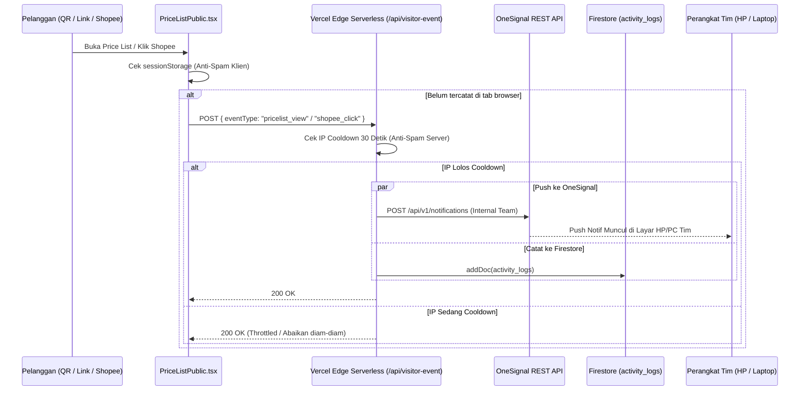

# Sistem Notifikasi & Pelacakan Pengunjung (Notification System)

Dokumen ini mendokumentasikan arsitektur push notification, alur pelacakan pengunjung (*visitor event tracking*), mekanisme anti-spam, dan integrasi OneSignal pada **Tanabrew Stock & Invoice**.

---

## 🔔 1. Arsitektur Komponen

---

## 🛡️ 2. Mekanisme Proteksi Anti-Spam Ganda (Dual-Layer Throttling)

Untuk mencegah notifikasi membombardir HP tim jika ada pengunjung yang me-refresh halaman terus-menerus atau membuka banyak tab:

1. **Proteksi Sisi Klien (`sessionStorage`)**:
   - Disimpan di memori tab peramban pengguna:
     - `tanabrew_tracked_pricelist_view`
     - `tanabrew_tracked_shopee_click`
   - Sekali terpicu, browser pengunjung tidak akan mengirim permintaan API lagi selama sesi tab tersebut aktif.
2. **Proteksi Sisi Server (`api/visitor-event.ts`)**:
   - Serverless function menyimpan jejak IP klien terakhir dalam map memori (*in-memory cache*).
   - Diberlakukan jeda waktu cooldown minimal **30 detik** per alamat IP untuk tipe event yang sama.
   - Jika ada IP yang sama memanggil endpoint sebelum 30 detik berakhir, server akan merespons `200 OK` tanpa memicu panggilan ke OneSignal maupun penulisan ke database.

---

## 📝 3. Standar Format & Teks Notifikasi (Bebas Emotikon)

Sesuai permintaan operasional, notifikasi otomatis pengunjung **wajib menggunakan bahasa formal, bersih, dan TANPA EMOTIKON**:

| Event | Header Notifikasi | Isi Pesan Notifikasi |
| :--- | :--- | :--- |
| **Buka Price List / Scan QR** | `Tanabrew Price List` | `"seseorang mengunjungi pricelist"` |
| **Klik Tombol Shopee** | `Tanabrew Shopee` | `"seseorang mengunjungi shopee tanabrew"` |

### Karakteristik OneSignal:
- Menggunakan OneSignal Segments: `["Total Subscriptions"]` untuk menyiarkan pesan ke seluruh perangkat anggota tim yang telah mengizinkan notifikasi browser (*web push*).
- Prioritas pengiriman: Level `10` (Immediate Delivery) agar sampai ke ponsel tim dalam hitungan detik.

---

## 🔒 4. Isolasi Halaman Publik

- Rute `/pricelist` dan `/menu` adalah halaman untuk pelanggan umum.
- Komponen `AutoUpdateBanner.tsx` dan modal `AppUpdateAnnouncementModal.tsx` **dilarang muncul** di rute ini.
- Pelanggan yang membaca menu tidak akan pernah terganggu oleh pesan update sistem atau jendela dialog internal.
