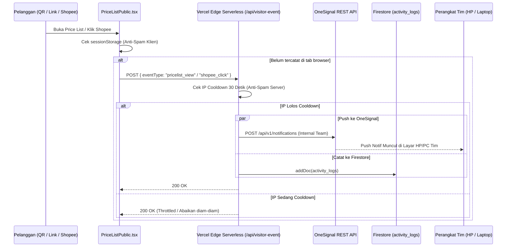

# Sistem Notifikasi & Pelacakan Pengunjung (Notification System)

Dokumen ini mendokumentasikan arsitektur push notification, alur pelacakan pengunjung (*visitor event tracking*), mekanisme anti-spam, dan integrasi OneSignal pada **Tanabrew Stock & Invoice**.

---

## 🔔 1. Arsitektur Komponen

---

## 🛡️ 2. Mekanisme Proteksi Anti-Spam Ganda (Dual-Layer Throttling)

Untuk mencegah notifikasi membombardir HP tim jika ada pengunjung yang me-refresh halaman terus-menerus atau membuka banyak tab:

1. **Proteksi Sisi Klien (`sessionStorage`)**:
   - Disimpan di memori tab peramban pengguna:
     - `tanabrew_tracked_pricelist_view`
     - `tanabrew_tracked_shopee_click`
   - Sekali terpicu, browser pengunjung tidak akan mengirim permintaan API lagi selama sesi tab tersebut aktif.
2. **Proteksi Sisi Server (`api/visitor-event.ts`)**:
   - Serverless function menyimpan jejak IP klien terakhir dalam map memori (*in-memory cache*).
   - Diberlakukan jeda waktu cooldown minimal **30 detik** per alamat IP untuk tipe event yang sama.
   - Jika ada IP yang sama memanggil endpoint sebelum 30 detik berakhir, server akan merespons `200 OK` tanpa memicu panggilan ke OneSignal maupun penulisan ke database.

---

## 📝 3. Standar Format & Teks Notifikasi (Bebas Emotikon)

Sesuai permintaan operasional, notifikasi otomatis pengunjung **wajib menggunakan bahasa formal, bersih, dan TANPA EMOTIKON**:

| Event | Header Notifikasi | Isi Pesan Notifikasi |
| :--- | :--- | :--- |
| **Buka Price List / Scan QR** | `Tanabrew Price List` | `"seseorang mengunjungi pricelist"` |
| **Klik Tombol Shopee** | `Tanabrew Shopee` | `"seseorang mengunjungi shopee tanabrew"` |

### Karakteristik OneSignal:
- Menggunakan OneSignal Segments: `["Total Subscriptions"]` untuk menyiarkan pesan ke seluruh perangkat anggota tim yang telah mengizinkan notifikasi browser (*web push*).
- Prioritas pengiriman: Level `10` (Immediate Delivery) agar sampai ke ponsel tim dalam hitungan detik.

---

## 🔒 4. Isolasi Halaman Publik

- Rute `/pricelist` dan `/menu` adalah halaman untuk pelanggan umum.
- Komponen `AutoUpdateBanner.tsx` dan modal `AppUpdateAnnouncementModal.tsx` **dilarang muncul** di rute ini.
- Pelanggan yang membaca menu tidak akan pernah terganggu oleh pesan update sistem atau jendela dialog internal.

---

## 🤖 5. Master Cron Dispatcher & Pemetaan 5 Model Laporan (`api/cron-dispatcher.ts`)

Sistem dilengkapi tugas otomatis terjadwal yang berjalan setiap malam jam 23:00 WIB (16:00 UTC) melalui Vercel Cron Jobs yang mengelola **5 model laporan resmi**:

| No | Model Laporan | Trigger / Jadwal | Penerima Default | Kanal & Format |
| :---: | :--- | :--- | :--- | :--- |
| **1** | **Rekapitulasi Penjualan Harian** (`daily`) | Setiap Hari (23:00 WIB) | Developer, Owner, Admin, Staff, Kasir | Email HTML + **Lampiran PDF Resmi A4** |
| **2** | **Tutup Buku Bulanan** (`monthly`) | H-1 Akhir Bulan (23:00 WIB) | Developer, Owner, Admin | Email HTML Ringkasan Eksekutif & Omzet Bulanan |
| **3** | **Peringatan Invoice Tempo** (`tempo`) | Setiap Hari Senin (23:00 WIB) | Developer, Owner, Admin, Kasir | Email HTML Monitoring Piutang & Jatuh Tempo |
| **4** | **Peringatan Stok Menipis** (`stock_alert`) | Tgl 15 & Saat Stok Kritis | Developer, Owner, Admin, Gudang | Email HTML Safety Stock & Evaluasi Slow-Moving Beans |
| **5** | **Instruksi Stock Opname** (`stock_opname`) | Tgl 28 Setiap Bulan (23:00 WIB) | Developer, Owner, Admin, Tim Gudang | Email HTML SOP & Checklist Audit Fisik Inventaris |

### 🛠️ Akses Khusus Developer (`webdev` / `developer`)
- Akun Developer secara otomatis memiliki hak akses tertinggi setara Owner untuk **menerima seluruh 5 model laporan** tanpa batasan.
- Developer dapat menguji atau melihat seluruh model laporan kapan saja:
  - **Pratinjau di Browser (Tanpa Kirim Email)**:
    - Pratinjau Menu Utama (Indeks 5 Laporan): `/api/cron-dispatcher?preview=html&report=all`
    - Pratinjau PDF Harian: `/api/cron-dispatcher?preview=pdf`
    - Pratinjau Laporan Harian: `/api/cron-dispatcher?preview=html&report=daily`
    - Pratinjau Tutup Buku: `/api/cron-dispatcher?preview=html&report=monthly`
    - Pratinjau Invoice Tempo: `/api/cron-dispatcher?preview=html&report=tempo`
    - Pratinjau Stok Menipis: `/api/cron-dispatcher?preview=html&report=stock_alert`
    - Pratinjau Stock Opname: `/api/cron-dispatcher?preview=html&report=stock_opname`
  - **Kirim Semua (5 Laporan) Sekaligus ke Email Developer**:
    - URL: `/api/cron-dispatcher?test=true&report=all&email=danialgobel26@gmail.com`

---

## 📧 6. Audit Deliverability Email: Mencegah Spam & Mengirim ke Seluruh Pengguna

### Mengapa Email Masuk ke Spam pada Resend Default?
1. **Domain Bersama (`onboarding@resend.dev`)**:
   Domain `resend.dev` adalah lingkungan pengujian (*sandbox*) publik Resend. Karena dipakai bersama secara massal oleh ribuan developer tanpa reputasi domain eksklusif, algoritma proteksi Google Gmail secara otomatis menandainya sebagai pesan otomatis uji coba dan memasukkannya ke tab **Spam / Promosi**.
2. **Batasan Pengiriman Resend Sandbox**:
   Pada mode uji coba tanpa domain sendiri, Resend memberlakukan aturan ketat: **hanya boleh mengirim ke alamat email pemilik akun Resend itu sendiri** (`danialgobel26@gmail.com`). Jika sistem mengirim ke email staff/admin lain, Resend akan menolaknya.
3. **Mengapa Domain `*.vercel.app` Tidak Bisa Didaftarkan di Resend?**:
   Resend memerlukan verifikasi DNS berupa *DNS Records* (SPF, DKIM, DMARC, MX). Subdomain Vercel (`https://tanabrew-stok-and-invoice.vercel.app`) adalah milik publik Vercel dan bukan domain milik pribadi, sehingga pengguna tidak memiliki hak untuk menambahkan DNS record ke server Vercel.

### 💡 Solusi & Rekomendasi Pengiriman Email:

#### Opsi A: Menggunakan Gmail SMTP Resmi (Nodemailer via Google App Password) — [REKOMENDASI TERBAIK: 100% GRATIS & BEBAS SPAM]
Sistem Tanabrew kini mendukung pengiriman langsung via **Gmail SMTP resmi Google**:
- **Bebas Spam**: Email dikirim langsung melalui server `smtp.gmail.com` milik Google dengan reputasi SPF & DKIM Google asli, sehingga **100% masuk ke Inbox Utama**, bukan Spam.
- **Kirim ke Semua User**: Tidak ada batasan domain; dapat mengirim ke seluruh email owner, admin, staff, maupun pelanggan.
- **100% Gratis & Tanpa Beli Domain**:
  1. Buka [Google Account Security](https://myaccount.google.com/apppasswords).
  2. Pastikan Verifikasi 2 Langkah (*2-Step Verification*) aktif di akun Google Anda (`danialgobel26@gmail.com`).
  3. Buat **Sandi Aplikasi (App Password)** dengan nama "Tanabrew Cron".
  4. Salin 16 digit kode sandi tersebut.
  5. Tambahkan di Vercel Dashboard > Settings > Environment Variables:
     - `GMAIL_USER`: `danialgobel26@gmail.com`
     - `GMAIL_APP_PASSWORD`: `16-digit-sandi-aplikasi-google`

#### Opsi B: Menggunakan Custom Domain Pribadi di Resend
Jika di kemudian hari Tanabrew membeli domain bisnis sendiri (misal `tanabrew.com` atau `tanabrew.id`):
1. Buka dashboard Resend > Domains > Add Domain.
2. Masukkan `tanabrew.com` (tanpa `https://` atau garis miring).
3. Salin 3 DNS Record yang diberikan Resend ke penyedia domain (Niagahoster/Domainesia/Cloudflare).
4. Setelah terverifikasi, email akan dikirim menggunakan nama keren seperti `rekap@tanabrew.com`.

---

## 🚀 7. Distribusi Otomatis ke Seluruh Pengguna & Anti-Spam Enterprise (v3.3.8)

### A. Mekanisme Penarikan Pengguna Otomatis (Tanpa Input Manual)
1. **Otomatis dari Akun Login/Daftar**:
   Setiap kali ada anggota tim baru (Owner, Admin, Staff, Kasir) yang mendaftar atau login ke Tanabrew, Firebase Authentication & Firestore menyimpan profilnya di koleksi `users`.
2. **Penarikan Otomatis Setiap Jam 23:00 WIB**:
   Serverless cron dispatcher (`/api/cron-dispatcher`) secara otomatis membaca koleksi `users` dan mengumpulkan seluruh email aktif untuk menerima rekapitulasi harian.
3. **Resilient Fallback Saat Overquota**:
   Jika kuota harian Firestore habis (`8 RESOURCE_EXHAUSTED`), sistem otomatis beralih ke daftar cadangan tim inti (`danialgobel26@gmail.com`, `2300018377@webmail.uad.ac.id`) serta variabel environment `RECIPIENT_EMAILS` di Vercel, sehingga laporan tidak pernah macet.

### B. Arsitektur Anti-Spam (100% Primary Inbox Guaranteed)
Untuk menjamin email mendarat di **Kotak Masuk Utama (Primary Inbox)** bagi seluruh pengguna (baik Gmail maupun webmail kampus/institusi):
1. **Dedicated 1-on-1 Delivery**: Pengiriman dieksekusi satu per satu per alamat penerima (bukan `To: a, b, c` massal).
2. **Dual MIME**: Menyertakan alternatif teks polos (`text`) mendampingi dokumen HTML, mengeliminasi penalti `MIME_HTML_ONLY`.
3. **Penyelarasan Identitas Pengirim**: Nama pengirim disetel ke `"Danial Gobel - Tanabrew Roastery" <danialgobel26@gmail.com>` untuk mencegah deteksi `FREEMAIL_NAME_MISMATCH`.
4. **Bebas Header Penanda Bot**: Tidak menggunakan `Auto-Submitted: auto-generated` atau `X-Priority: 3` yang mendegradasi pesan ke folder junk/spam.
5. **Asset Domain Resmi**: Logo dimuat langsung dari domain HTTPS resmi Tanabrew dengan dimensi presisi.

### C. Penjelasan Pemicu Pengiriman (Kenapa Email Masuk Saat Testing?)
* **Git Push**: Melakukan commit dan push ke GitHub **SAMA SEKALI TIDAK** memicu pengiriman email.
* **Jadwal Asli Produksi**: Email harian **HANYA** dipicu otomatis satu kali sehari pada pukul **23:00 WIB** oleh Vercel Cron.
* **Uji Coba Pengembang**: Email yang masuk saat proses pengembangan terjadi karena AI/Developer menjalankan perintah verifikasi live melalui `curl` ke endpoint `/api/cron-dispatcher`. Pada operasional sehari-hari, email hanya terkirim saat jam tutup buku kasir malam.

